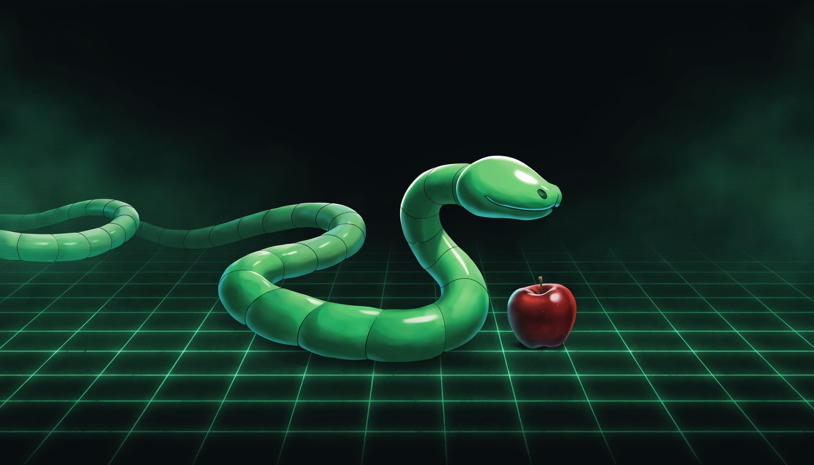

<div align="center">

# 🐍 Nibble

**The Nokia snake, reborn as an installable web game** — classic mode, level challenges, unlockable themes and skins, and a leaderboard.


<br>

[](https://nunoamorim99.github.io/nibble/)

### [▶️ Play it now — nunoamorim99.github.io/nibble](https://nunoamorim99.github.io/nibble/)

_Free in your browser, nothing to install — or add it to your home screen and play offline._

</div>

---

Nibble is a from-scratch take on the game everyone played on their Nokia 3310. It began as a learning project — a way to understand how these games actually work under the hood: the game loop, collision detection, and state management — and grew into a small, polished, installable web game. The name nods to both the snake *nibbling* apples and the **nibble** (4 bits, half a byte), which felt fitting for a project about learning to build games in code.

## ✨ Features

- **Classic mode** — the original loop: eat, grow, and don't crash into yourself or the wall. Chase your high score.
- **Level mode** — clear a target number of apples to advance. Each level layers in obstacles and a new twist.
- **Challenge modifiers** — composable difficulty flags rather than separate game modes: 2× speed, walls-that-kill vs. wrap-around edges, and obstacle mazes. Mix and match.
- **Themes & skins** — from the authentic monochrome pixel look to colorful and cartoon styles. Swap them freely.
- **Coins & shop** — earn coins as you play and spend them to unlock cosmetic themes and snake skins. Cosmetic only — no pay-to-win.
- **Leaderboard** — local-first, with an optional global board backed by Supabase.
- **Installable PWA** — add it to your home screen or desktop and play fully offline.

## 🧱 Tech stack

| Concern | Choice |
|---|---|
| Language | TypeScript |
| Build & dev server | Vite |
| Installable app | `vite-plugin-pwa` (Workbox) |
| Rendering | HTML5 Canvas (2D) |
| Persistence | IndexedDB (behind a thin adapter) |
| Tests | Vitest |
| Theme art (later) | Higgsfield (the classic theme is drawn in code) |

## 🏗️ Architecture

Nibble is built as **five decoupled layers**. The whole feature set — modes, themes, skins, levels, the economy — stays manageable only because these layers never reach into each other's internals.

1. **Engine** (`src/engine/`) — pure game logic: grid, snake, tick/update, collision, food, scoring, and the mode rule engine. No DOM, no canvas, fully deterministic and unit-tested.
2. **Renderer** (`src/render/`) — reads engine state plus the active theme and draws to the canvas. Contains **zero** game rules.
3. **Themes** (`src/themes/`) — data only. A theme is a set of tokens; swapping a theme is swapping a data object.
4. **Levels** (`src/levels/`) — data only. Each level or challenge is a config object with modifier flags the engine reads.
5. **Persistence & economy** (`src/data/`) — IndexedDB behind one adapter interface, ready to swap for a remote backend later.

> **The golden rule:** the engine depends on nothing above it. If a game rule lives in the renderer, it's a bug.

See [`CLAUDE.md`](./CLAUDE.md) for the full conventions and invariants.

## 🚀 Getting started

**Just want to play?** No setup needed — the game is live at **[nunoamorim99.github.io/nibble](https://nunoamorim99.github.io/nibble/)**.

To work on it locally — **prerequisites:** Node.js 20+ and npm.

```bash
# 1. Clone
git clone https://github.com/nunoamorim99/nibble.git
cd nibble

# 2. Install
npm install

# 3. Run the dev server
npm run dev
```

| Command | What it does |
|---|---|
| `npm run dev` | Start the Vite dev server with hot reload |
| `npm run build` | Production build |
| `npm run preview` | Preview the built PWA locally |
| `npm run test` | Run the Vitest unit tests |

## 📁 Project structure

```
nibble/
├─ index.html
├─ vite.config.ts
├─ CLAUDE.md              # architecture + working rules
├─ PROJECT_PLAN.md        # phased roadmap
├─ .claude/agents/        # Claude Code subagents (see below)
├─ public/                # manifest + icons
├─ src/
│  ├─ engine/             # pure game logic
│  ├─ render/             # canvas rendering
│  ├─ themes/             # theme data + registry
│  ├─ levels/             # level/challenge config
│  ├─ data/               # persistence + economy
│  └─ ui/                 # menus, shop, leaderboard, settings
├─ assets/sprites/        # generated theme art
└─ tests/                 # unit tests + playtest checklist
```

## 📲 Install it as an app

Nibble is a PWA — open **[the live game](https://nunoamorim99.github.io/nibble/)**, install it, and play offline:

- **Desktop (Chrome / Edge):** open the site, then click the **install icon** in the address bar (or menu → _Install Nibble_).
- **Android:** menu → _Add to Home screen_.
- **iOS (Safari):** Share → _Add to Home Screen_.

Once installed it launches in its own window and works without a connection.

## 🌐 Deployment

Every push to `main` runs the tests, builds, and deploys to **GitHub Pages** at [nunoamorim99.github.io/nibble](https://nunoamorim99.github.io/nibble/) via [`deploy-pages.yml`](./.github/workflows/deploy-pages.yml). The optional global leaderboard is switched on at build time by two repository Actions settings — a `VITE_LEADERBOARD_URL` variable and a `VITE_LEADERBOARD_ANON_KEY` secret (see [`docs/REMOTE_LEADERBOARD.md`](./docs/REMOTE_LEADERBOARD.md)); without them the build simply stays local-only.

## 🗺️ Roadmap

Development runs in phases, each with a clear definition of done. Full detail lives in [`PROJECT_PLAN.md`](./PROJECT_PLAN.md).

- **Phase 0–2** — Foundations, classic MVP, polish + PWA + local leaderboard
- **Phase 3–4** — Theme system, coins & shop
- **Phase 5–6** — Level mode + challenges, more content & polish
- **Phase 7** — Optional global leaderboard
- **Phase 8** — Native app via Capacitor (reusing the web code)

Phases 0–7 are done and live in the [deployed build](https://nunoamorim99.github.io/nibble/); Phase 8 is up next.

## 🤖 Built with Claude Code

This repo is set up to be developed with [Claude Code](https://www.claude.com/product/claude-code). Eight project subagents live in [`.claude/agents/`](./.claude/agents) and are loaded automatically at session start, each owning one layer of the architecture:

| Agent | Owns |
|---|---|
| `game-engine` | Core loop, movement, collision, food, mode/level rule engine |
| `renderer-themes` | Canvas drawing and the theme system |
| `ui-shell` | Menus, shop, leaderboard/settings screens, PWA shell |
| `persistence-economy` | IndexedDB, scores, coins, unlocks, leaderboard adapter |
| `level-designer` | Level/challenge config data and difficulty balance |
| `art-pipeline` | Generating and processing theme art via Higgsfield |
| `qa-tester` | Engine unit tests and the playtest checklist |
| `reviewer` | Read-only architecture review before commits |

Run `/agents` inside Claude Code to see and manage them. A typical flow: kick off a phase in **plan mode**, let the relevant agent implement it, then run the `reviewer` agent before committing.

## 🎨 Art

Themes follow an "evolution of Snake" ladder — from the faithful monochrome original up through colored pixel, detailed, cartoon, and futuristic looks (see [`docs/THEMES.md`](./docs/THEMES.md)). The classic and early themes are drawn entirely in code, with no image assets. Snake skins and food sprites for the richer themes are **code-generated spritesheets** (TypeScript + `sharp`, with SVG as the source for detailed art), so the pipeline is fully automatable end to end. **Higgsfield** is used only for scenic **backgrounds** on the illustrated themes — never for the snake itself, since consistent creature sets are exactly where image models fall down. All unlockables are purely cosmetic.

## 🤝 Contributing

This is primarily a personal learning project, but issues and suggestions are welcome. If you open a PR, please keep the architecture boundaries intact (see `CLAUDE.md`) and add unit tests for any engine changes.

## 📄 License

Released under the [MIT License](./LICENSE). _(Add a `LICENSE` file if you haven't yet — MIT is a good default for a project like this.)_

## 🙏 Acknowledgments

- Inspired by the original **Nokia Snake**.
- Themed art powered by **Higgsfield**.
- Built with **Claude Code**.
